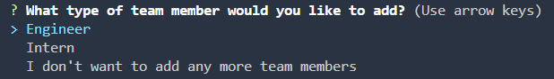

# Team Profile Generator

>**User Story:** As a manager a user want to generate a webpage that displays my team's basic info so that a user have quick access to their emails and GitHub profiles. 

## Table of Contents
- [Description](#description)
- [Demonstration](#demonstration)
- [Installation](#installation)
- [Usage](#usage)
- [License](#license)
- [Contribution](#contribution)
- [Test](#test)
- [Get In Touch](#get-in-touch)


## Description

With this project, the user can quickly generate a profile for each of the team members (based on their role within the team) including role, ID number, email, github account info, phone number and school they attend.

## Demonstration

After running the application, you should see the following:


---

Below image shows how you can use arrow keys to select the role of each employee.



---
Below you can see the final product of what the HTML page should look like once generated.


---

## Installation
1. Ensure you have node.js installed on your device.
2. Clone the repo to your local device. 
3. Navigate to the folder and run ```npm init -y``` and ```npm i``` to install packages  

## Usage
To use the application, run ```node index.js``` and answer the series of questions that come up in the terminal. You'll then have a HTML generated with all the relevant information.

## License
This project is licensed under the MIT license. Click the below badge for further information.

[](https://opensource.org/licenses/MIT)

## Contribution
N/A

## Test
To run the testing suite, type ```npm run test``` in the terminal to run testing via Jest. Further details of the tests can be found within the __tests__ folder.


## Get In Touch
For any questions relating to the project, please feel free to get in touch with me via email at: [aaronarmstrong1490@gmail.com](mailto:aaronarmstrong1490@gmail.com)
Feel free to also check out my GitHub profile and follow along at: [aaron1490](https://github.com/aaron1490)
